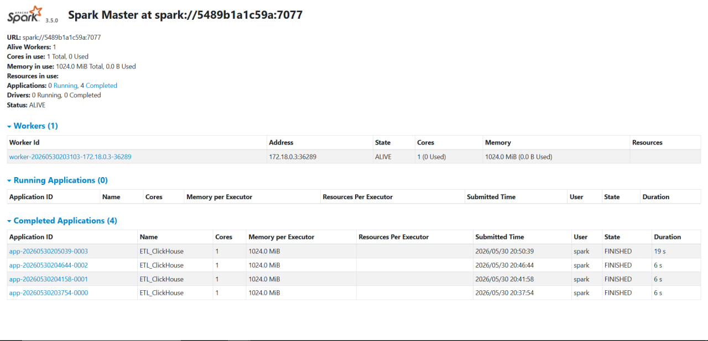

# Лабораторная работа №2: ETL-пайплайн с помощью Apache Spark

## Описание проекта
В данной лабораторной работе реализован ETL-процесс с использованием Apache Spark. 
Данные извлекаются из нормализованной схемы БД PostgreSQL, трансформируются и агрегируются в памяти кластера Spark, после чего загружаются в аналитическую колоночную БД **ClickHouse**.

Сформировано 6 витрин данных:
1. `report_products`
2. `report_customers`
3. `report_time`
4. `report_stores`
5. `report_suppliers`
6. `report_quality` 

## Инструкция по запуску

### 1. Запуск инфраструктуры
Проект упакован в Docker. Для поднятия PostgreSQL, Spark (Master + Worker) и ClickHouse выполните:
```bash
docker-compose up -d
```

### 2. Запуск ETL-процесса (Spark Job)
После инициализации баз данных отправьте задачу в кластер Spark:
```bash
docker exec -it spark-master /opt/bitnami/spark/bin/spark-submit \
  --master spark://spark-master:7077 \
  --jars /opt/jars/postgresql-42.7.1.jar,/opt/jars/clickhouse-jdbc-0.6.0-patch5-shaded.jar \
  /opt/spark_apps/ch_reports.py
```
*Примечание: прогресс выполнения можно отслеживать в Spark UI по адресу `http://localhost:8080`.*

### 3. Проверка результатов в ClickHouse
Убедиться, что таблицы успешно созданы:
```bash
docker exec -it clickhouse clickhouse-client --user ch_admin --password ch_password --query "SHOW TABLES;"
```
Ожидаемый результат:
```
 "SHOW TABLES;"
report_customers
report_products
report_quality
report_stores
report_suppliers
report_time
```

Пример выборки из витрины продаж по продуктам:
```bash
docker exec -it clickhouse clickhouse-client --user ch_admin --password ch_password --query "SELECT * FROM report_products LIMIT 5;"
```

Ожидаемый результат:
```
 "SELECT * FROM report_products LIMIT 5;"
Bird Cage       Toy     296563.92       6261    2.98
Dog Food        Toy     293603.41       6346    3.01
Dog Food        Food    283588.88       6196    3
Cat Toy Cage    280212.67       6067    2.99
Bird Cage       Cage    279530.37       6234    3
```

Успешний запуск Spark UI:
